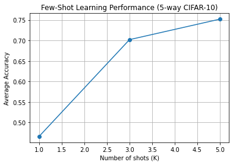
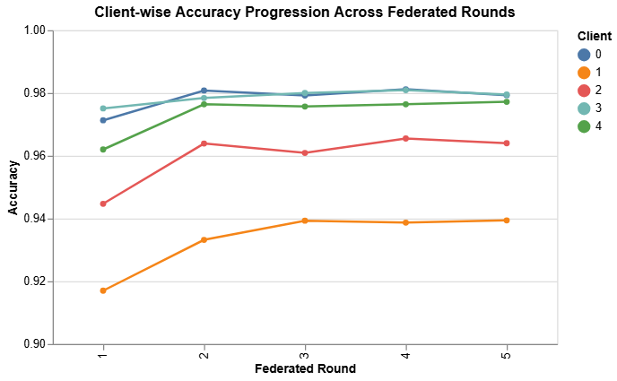
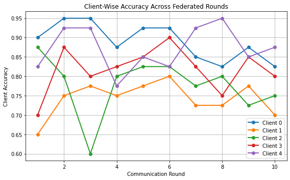
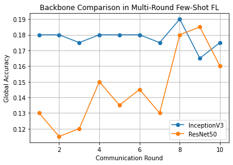

# Few-Shot Federated Learning: An Empirical Study under Extreme Data Scarcity

## Overview

This project presents a structured empirical analysis of Few-Shot Federated Learning (FSFL) using the CIFAR-10 dataset.

The study investigates the interaction between two challenging constraints:

- **Few-Shot Learning (FSL)** — only a small number of labeled samples per class.
- **Federated Learning (FL)** — decentralized clients with non-IID data that cannot share raw samples.

Rather than proposing a novel algorithm, this work focuses on analyzing feasibility, convergence behavior, and structural limitations when few-shot learning is deployed in a federated setting.

---

## Experimental Design

The experiments are organized into three controlled stages to isolate effects:

### Stage 1 — Centralized Few-Shot Learning
- Prototype-based classification (metric learning approach)
- InceptionV3 backbone (ImageNet pretrained, frozen)
- Episodic evaluation (5-way classification)
- 1-shot, 3-shot, and 5-shot settings

### Stage 2 — Standard Federated Learning
- 5 simulated non-IID clients
- 2 classes per client
- FedAvg aggregation
- Multi-round communication
- Client-wise accuracy tracking

### Stage 3 — Few-Shot Federated Learning
- 5-shot per class per client
- Prototype-based communication (no gradient sharing)
- Server-side prototype averaging
- Multi-round aggregation (10 rounds)
- Client-wise performance analysis
- Backbone comparison (InceptionV3 vs ResNet50)

---

## Key Results

| Setting | Accuracy |
|----------|----------|
| 5-shot Centralized Few-Shot | ~0.78 |
| Standard Federated Learning | ~0.96–0.97 |
| Few-Shot Federated Learning | ~0.18 |

### Core Observations

- Few-shot learning performs well when centralized.
- Federated learning performs strongly with sufficient local data.
- Combining both constraints leads to significant performance degradation.
- Multi-round prototype aggregation shows early saturation.
- Client-wise disparities persist under non-IID conditions.
- Backbone strength alone does not overcome representation bottlenecks.

---

## Visual Results

### Stage 1 — Centralized Few-Shot Learning

<p align="center">
  
</p>

**Figure 1:** Centralized few-shot accuracy across 1-shot, 3-shot, and 5-shot settings.

---

### Stage 2 — Standard Federated Learning

<p align="center">
  
</p>

**Figure 2:** Client-wise accuracy across communication rounds using FedAvg.

---

### Stage 3 — Few-Shot Federated Learning

<p align="center">
  
</p>

**Figure 3:** Client-wise accuracy across multi-round prototype-based federated learning.

---

### Backbone Comparison — InceptionV3 vs ResNet50

<p align="center">
  
</p>

**Figure 4:** Performance comparison between InceptionV3 and ResNet50 under few-shot federated constraints.

---

## Experimental Insights

This study demonstrates that:

- Prototype-based communication is communication-efficient.
- Extreme data scarcity limits meaningful knowledge accumulation.
- Frozen representations restrict cross-client adaptation.
- Repeated aggregation mainly recombines noisy few-shot estimates.
- Few-shot federated learning exhibits structural limitations under severe constraints.

These findings clarify why few-shot federated learning remains challenging in real-world privacy-preserving environments.

---

## Repository Contents

- `FSFL.ipynb` — Full experimental pipeline (all three stages)
- `results/` — Saved experimental plots
- `requirements.txt` — Dependencies 

---

## Dataset Setup

This project uses the CIFAR-10 PNG version from Kaggle:

https://www.kaggle.com/datasets/swaroopkml/cifar10-pngs-in-folders

### Option 1: Manual Download

1. Download the dataset from the link above.
2. Extract the contents.
3. Place the extracted `cifar10/` folder inside:

## How to Run

1. Install dependencies:

```bash
pip install -r requirements.txt


